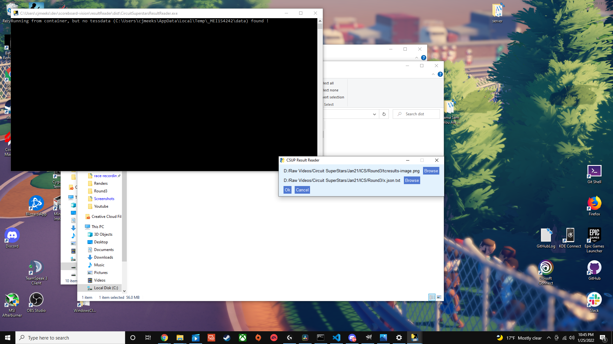
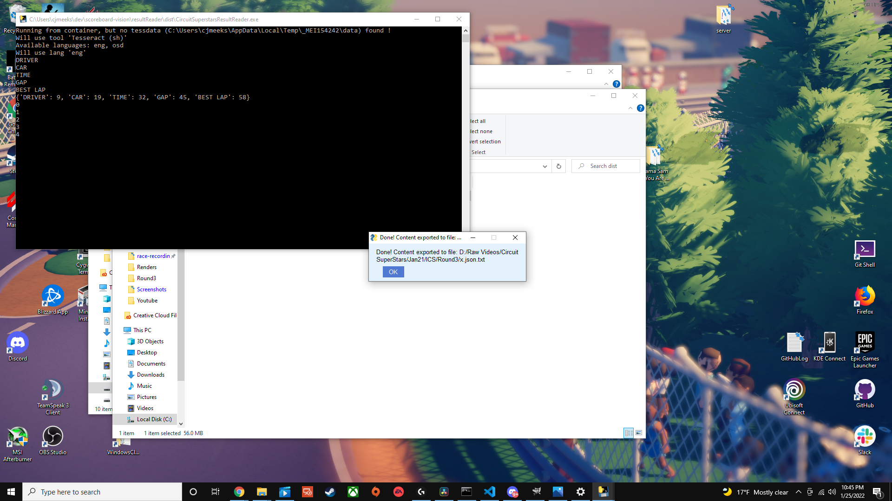
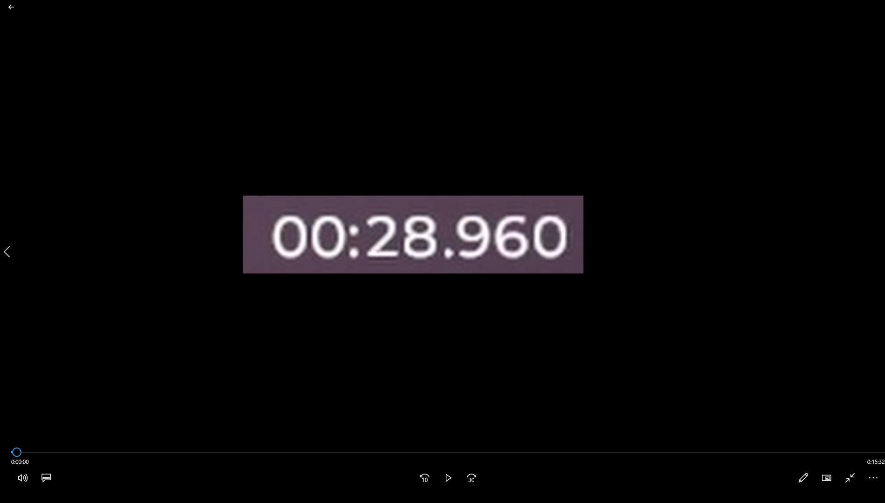
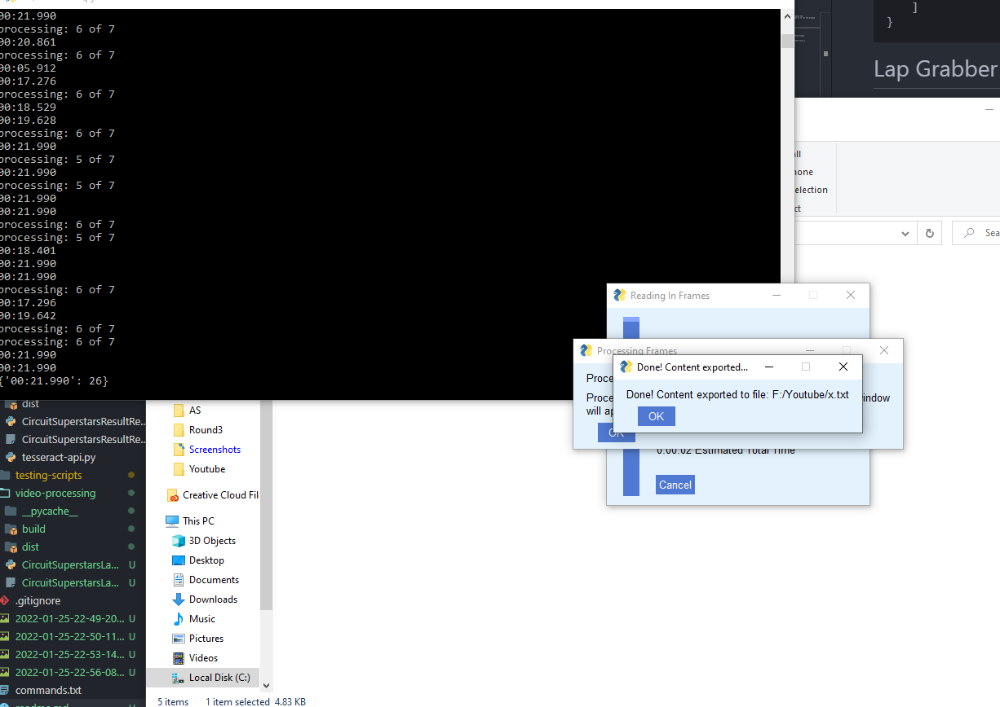
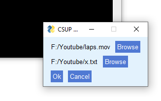
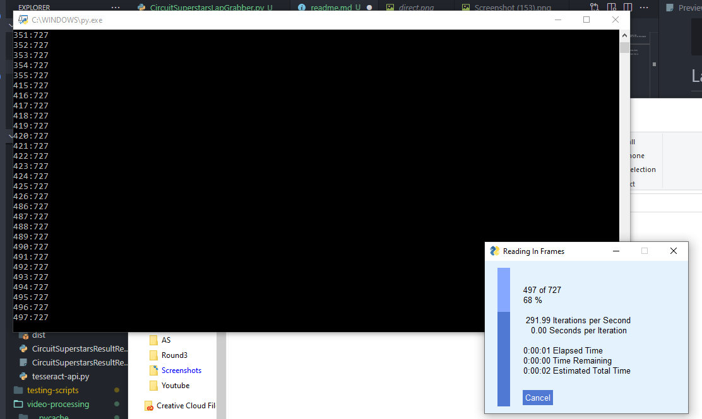
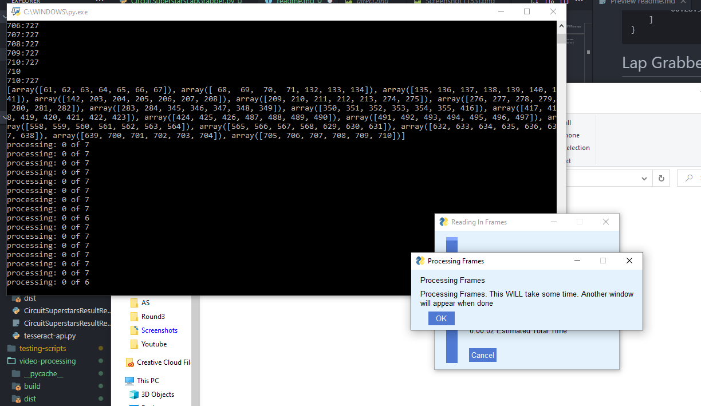

# ResultReader

## Installation

- You can download the latest .exe executable in the releases tab
- thats it, just put the exe where every you want and open it to run the program

## Prerequisites

- Input Image (Example)
  
- Output file created either .txt or .json

## Steps to use

1. open/double click the exe
2. Pick input and output files from file browser by clicking browse
   
3. After picking files press ok
4. you will see a finish screen re stating where your output file is
   
5. Example output

```{
    "DRIVER": [
        "9 FST | StarWrek",
        "g VSR Dremet",
        "\u00ae vse mevizn",
        "9 EBC | polruiz12",
        "\u00a9 ovd| muritopin",
        "\u20ac ovD | Bixon",
        "9 EBC | Black Rebel",
        "\u20ac psr| DAONES96",
        "iP) FST | Stonie"
    ],
    "CAR": [
        "Conquest",
        "| Conquest",
        "| Conquest",
        "| Conquest",
        "| Conquest",
        "| Conquest",
        "| Conquest",
        "| Conquest",
        "Conquest",
        "| Conquest",
        "| Conquest",
        "Conquest"
    ],
    "TIME": [
        "14:50.021",
        "14:57.318",
        "15:09.145",
        "15:10.889",
        "15:15.263",
        "15:15.539",
        "15:18.424",
        "14:54.811",
        "14:59.954",
        "15:15.052",
        "15:16.717",
        "15:15.000"
    ],
    "GAP": [
        "00:00.000",
        "00:07.297",
        "00:19.125",
        "00:20.868",
        "00:25.242",
        "00:25.518",
        "00:28.403",
        "00:04.790",
        "00:09.933",
        "00:25.032",
        "00:26.696",
        "00:24.979"
    ],
    "BEST LAP": [
        "00:27.085",
        "00:27.152",
        "00:27.516",
        "00:27.426",
        "00:27.473",
        "00:27.521",
        "00:27.470",
        "00:27.781",
        "00:27.925",
        "00:28.025",
        "00:28.312"
    ]
}
```

# Lap Grabber

## Installation

- You can download the latest .exe executable in the releases tab
- thats it, just put the exe where every you want and open it to run the program

## Prerequisites

- Input Video Cropped to the Lap: time display like the example here
  
- Output file created either .txt or .json



## Steps to use

1. open/double click the exe
2. Pick input and output files from file browser by clicking browse
   
3. After picking files press ok, reading in the video frames will begin
   
4. After reading in the video frames it will then begin processing the frames, this will take about 50% of the time of the video. so for a 10 min video this step will take 5 min
   
5. you will see a finish screen re stating where your output file is
   
6. Example output in output file

```
{
    "0": "00:33.159",
    "1": "00:32.058",
    "2": "00:32.270",
    "3": "00:32.638",
    "4": "00:32.414",
    "5": "00:32.422",
    "6": "00:36.737",
    "7": "00:41.607",
    "8": "00:32.456",
    "9": "00:32.309",
    "10": "00:32.295",
    "11": "00:32.533",
    "12": "00:32.611",
    "13": "00:36.751",
    "14": "00:41.856",
    "15": "00:32.210",
    "16": "00:32.174",
    "17": "00:32.749",
    "18": "00:32.181",
    "19": "00:32.433",
    "20": "00:36.815",
    "21": "00:42.150",
    "22": "00:32.225",
    "23": "00:32.904",
    "24": "00:32.420",
    "25": "00:32.482",
    "26": "00:32.365",
    "27": "00:32.873"
}
```
